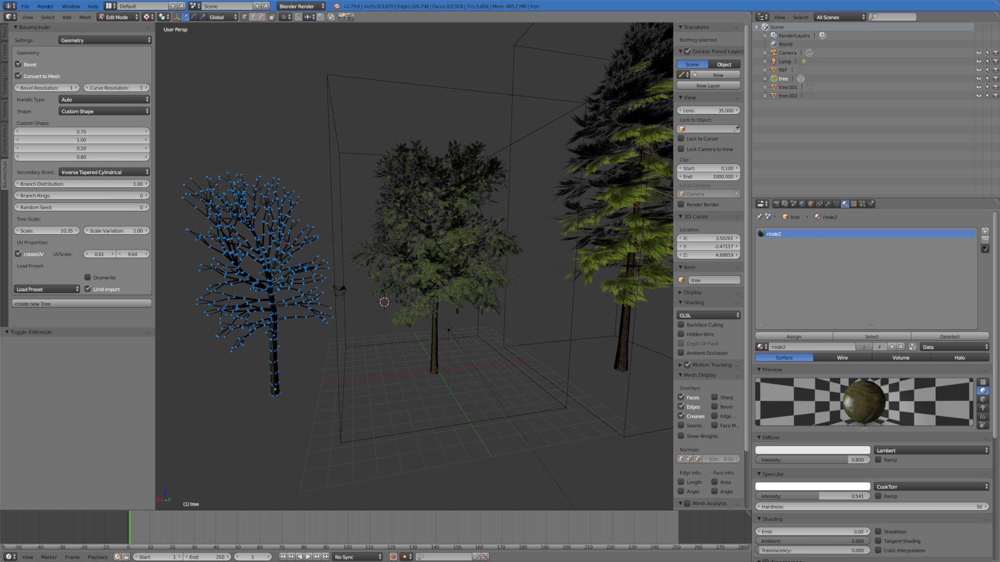

# Baumschule
Blender addon to create game ready trees. This addon is a modification of "Sapling_Tree", https://wiki.blender.org/wiki/Extensions:2.6/Py/Scripts/Curve/Sapling_Treeby Andrew Hale (TrumanBlending) and Aaron Buchler.

## Changes
* adds material-slots to branches and leafs
* tree can be modified at any time
* optimized mesh creation
    * fast mesh conversion
    * branches polygon reduction
* basic UV editing for branches and leafs
## Issues
* pruning, armature, animations and save presets not ported yet
